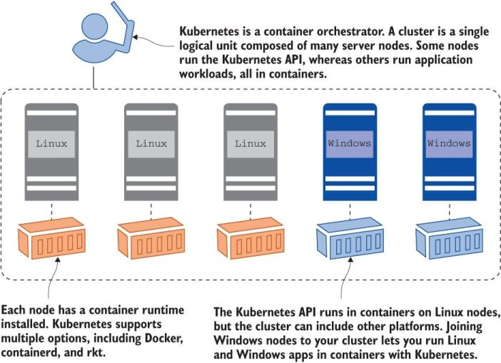
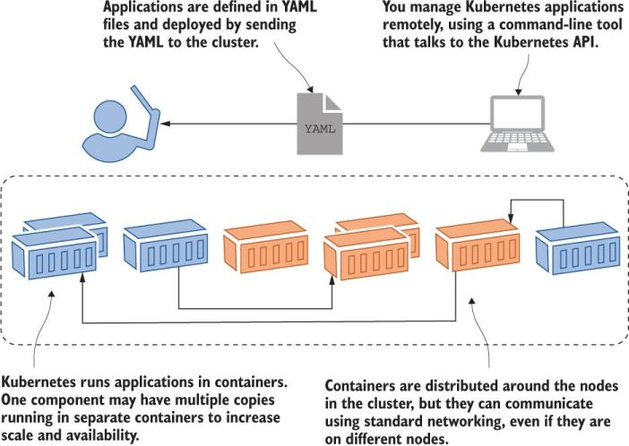
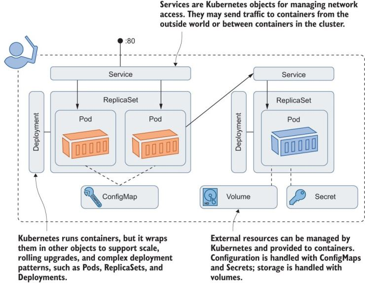

## About
Kubernetes is a platform for running containers. 

It takes care of starting your containerized applications, rolling out updates, maintaining service levels, scaling to meet demand, securing access, and much more. 

The two core concepts in Kubernetes are the **API**, which you use to define your applications, and the **cluster**, which runs your applications. 


A **cluster** is a set of individual servers that have all been configured with a container runtime like Docker, and then joined into a single logical unit with Kubernetes. The picture below shows a high-level view of the cluster.



The Kubernetes cluster is there to run your applications. You define your apps in *YAML* files and send those files to the Kubernetes API. Kubernetes looks at what you’re asking for in the YAML and compares it to what’s already running in the cluster. It makes any changes it needs to get to the desired state, which could be updating a configuration, removing containers, or creating new containers.



Those YAML files are properly called **application manifests**, because they’re a list of all the components that go into shipping the app. Those components are Kubernetes resources; they have proper names, too. The picture below takes the concepts from other photos and applies the correct Kubernetes resource names.



I use OrbStack since I have a Mac. Download it at: https://orbstack.dev/. Instructions given below are for Version 1.2.0-rc2 (16483). Yours may look different.

Open OrbStack, click **Pods**, then **Turn On**


Then go back to your command line, and type: 

```
kubectl get nodes
```

You should get an output that looks like this:

```
NAME       STATUS   ROLES                  AGE   VERSION
orbstack   Ready    control-plane,master   34d   v1.27.4+orb1
```

