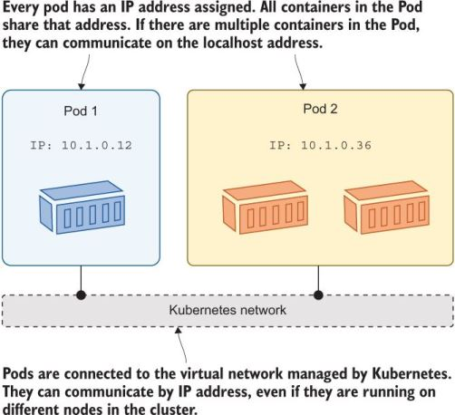
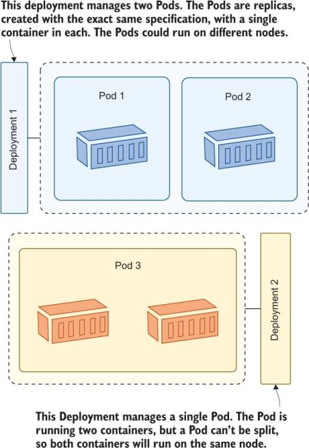

## Running containers in Kubernetes with Pods and Deployments
Kubernetes runs containers for your application workloads, but the containers themselves are not objects you need to work with. 

Every container belongs to a **Pod**, which is a Kubernetes object for managing one or more containers, and Pods, in turn, are managed by other resources. 

These higher-level resources abstract away the details of the container, which powers self-healing applications and lets you use a desired-state workflow: you tell Kubernetes what you want to happen, and it decides how to make it happen.

### Kubernetes and Containers
A container is a virtualized environment that typically runs a single application component. Kubernetes wraps the container in another virtualized environment: the **Pod**.

A Pod is a unit of compute, which runs on a single node in the cluster. 

The **Pod** has its own virtual IP address, which is managed by Kubernetes, and Pods in the cluster can communicate with other Pods over that virtual network, even if they’re running on different nodes.

You normally run a single container in a Pod, but you can run multiple containers in one Pod, which opens up some interesting deployment options.

All the containers in a Pod are part of the same virtual environment, so they share the same network address and can communicate using localhost. The photo below shows the relationship between containers and Pods.



Containers run inside Pods. You manage the Pods, and the Pods manage the containers.

You can run a simple Pod using the Kubernetes command line without needing a YAML specification. The syntax is similar to running a container using Docker: you state the container image you want to use and any other parameters to configure the Pod behavior.

```
# run a Pod with a single container; the restart flag tells Kubernetes to create just the Pod and no other resources:
kubectl run hello-world --image=kiamol/ch02-hello-kiamol --restart=Never
 
# wait for the Pod to be ready:
kubectl wait --for=condition=Ready pod hello-kiamol
 
# list all the Pods in the cluster:
kubectl get pods
 
# show detailed information about the Pod:
kubectl describe pod hello-kiamol
```

All Kubernetes environments use the same Container Runtime Interface mechanism to manage containers, but not all container runtimes allow you to access containers outside of Kubernetes. 

This shows you how a Kubernetes node keeps its Pod containers running, but you’ll only be able to follow it if you’re using Docker as your container runtime.

```
# find the Pod’s container:
docker container ls -q --filter label=io.kubernetes.container.name=hello-kiamol
 
# now delete that container:
docker container rm -f $(docker container ls -q --filter label=io.kubernetes.container.name=hello-kiamol)
 
# check the Pod status:
kubectl get pod hello-kiamol
 
# and find the container again:
docker container ls -q --filter label=io.kubernetes.container.name=hello-kiamol
```

For an instant, the Pod had zero containers, but Kubernetes immediately created a replacement to repair the Pod and bring it back to the correct state.

Kubectl can forward traffic from a node to a Pod, which is a quick way to communicate with a Pod from outside the cluster. You can listen on a specific port on your machine—which is the single node in your cluster—and forward traffic to the application running in the Pod.

```
# listen on port 8080 on your machine and send traffic
# to the Pod on port 80:
kubectl port-forward pod/hello-kiamol 8080:80
 
# now browse to http://localhost:8080
 
# when you’re done press ctrl-c to end the port forward
```

### Running Pods with Controllers
Pods are too simple to be useful on their own; they are isolated instances of an application, and each Pod is allocated to one node. If that node goes offline, the Pod is lost, and Kubernetes does not replace it.

Even if you do get Pods spread across several nodes, you need to manage them yourself. Why do that when you have an orchestrator that can manage them for you?

That’s where **controllers** come in. A controller is a Kubernetes resource that manages other resources. It works with the Kubernetes API to watch the current state of the system, compares that to the desired state of its resources, and makes any changes necessary. 

Kubernetes has many controllers, but the main one for managing Pods is the *Deployment*, which solves this problem.

If a node goes offline and you lose a Pod, the Deployment creates a replacement Pod on another node; if you want to scale your Deployment, you can specify how many Pods you want, and the Deployment controller runs them across many nodes. The photo below shows the relationship between Deployments, Pods, and containers.



Create another instance of the web application, this time using a Deployment. The only required parameters are the name for the Deployment and the image to run.

```
# create a Deployment called "hello-kiamol-2", running the same web app:
kubectl create deployment hello-kiamol-2 --image=kiamol/ch02-hello-kiamol
 
# list all the Pods:
kubectl get pods
```

